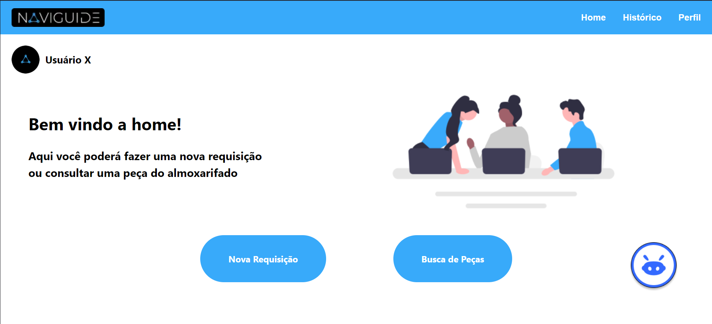
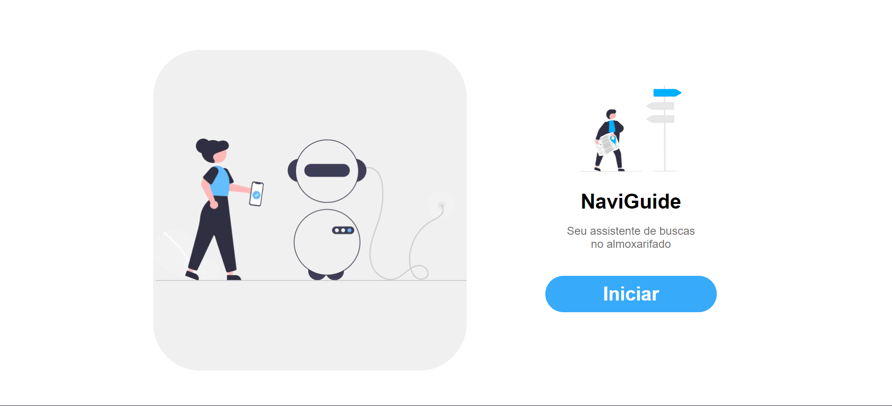

# Instruções de uso da Interface Gráfica com o Chatbot e Robô

Antes de tudo, certfique-se de ter o Node.js e o npm instalado na sua máquina. Pode ser? Então, vamos lá. 

Para executar a Interface gráfica, abra o terminal ou seu prompt de comando. Vamos pracisar de 3 (três) terminais rodando, um para interface outro para o backend e outro para para conexão com robô. Dessa maneira, navegue até o diretório do front-end utilizando no primeiro terminal o seguinte comando:

```python
cd grupo5/src/frontend
```

Em seguinda, para inciar o servidor local,  execute o seguinte comando:

```python
npm run dev
```
Após a execução bem-sucedida, acesse o navegador e vá para o enderenço:

```python
http://localhost:3000
```

No segundo terminal, execute:

```python
cd src/bridge
python3 socket_server.py
```

Já no terceiro, execute:

```python
cd src/backend/app

python3 main.py
```

**OBS: Não esquersa de colocar sua chave OPEN AI no arquivo .env!**

## Navegando na interface.

Ao acessar a interface no navegador, você encontrará uma página inicial com um esquema de cores azul e branco, apresentando um botão **"INICIAR"**. Com isso, entrará na página **HOME**.

**"Página de Boas-Vindas"**:

Após clicar em "INICIAR", você será redirecionado para a página de boas-vindas. Aqui, encontrará sete opções de rotas disponíveis:

- **Home**: Página inicial com informações principais.
- **Histórico**: Mostra o histórico de atividades ou eventos anteriores.
- **Perfil**: Permite acessar e editar as informações do perfil do usuário.
- **Nova Requisição**: Botão para criar uma nova solicitação ou pedido.
- **Buscar de Peças**: Acessa a funcionalidade para pesquisar peças ou itens específicos.
- **Chatbot**: Inicia a interação com o chatbot, uma ferramenta de comunicação automatizada.

Utilize os botões correspondentes para acessar as diferentes funcionalidades da aplicação.

Então, estamos na página principal, a página **HOME**. Vamos começar com as rotas que estão localizado na parte azul superior da tela, a Navbar. Onde tem "HOME", "HISTÓRICO" e "PERFIL".



Como já está na "HOME". Vamos para "HISTÓRICO".

## Navegação na Tela de Histórico.

Depois de navegar pela interface inicial e passar pela HOME, chegamos à tela de HISTÓRICO. Esta seção é acessível através da barra de navegação superior, clicando no botão "Histórico".

A tela de Histórico apresenta uma lista de atividades ou requisições passadas feitas pelo usuário. Sem contar que a interface é clara e intuitiva, exibindo as informações de forma tabular, o que facilita a visualização e o entendimento dos dados. 

Com isso, a estrutura da tabela é composta pelas seguintes colunas:

- **Id SAS**: Identificação única da sessão ou do serviço.
- **Nome usuário**: Nome do usuário que realizou a atividade ou requisição.
- **Nome Produto**: Descrição do item requisitado.
- **Quantidade**: Número de itens requisitados.
- **Data**: Data em que a requisição foi feita.

Essas funcionalidades interativas permitem que tenha

- **Pesquisa**: No topo da tela, há um campo de pesquisa onde você pode inserir termos para buscar entradas específicas no histórico, como por exemplo, data, id SAS ou simplesmente o nome de usuário.
  
- **Detalhamento**: Ao selecionar uma linha, pode-se ter acesso a mais detalhes sobre aquela requisição específica.

## Navegação na Tela de Perfil.

A tela de PERFIL é acessível a partir da barra de navegação superior do sistema, selecionando a opção "Perfil".

Ao entrar na opção, verá que um espaço dedicado para que os usuários possam visualizar e editar suas informações pessoais no sistema.Portanto, é um componente chave para a personalização e segurança da experiência do usuário.

Desse modo, existem alguns campos editáveis, os quais são apresentados campos para atualização das informações do usuário:

- **Primeiro Nome**: Campo para inserir ou editar o primeiro nome do usuário.
- **Sobrenome**: Campo destinado ao sobrenome do usuário.
- **Identificação**: Espaço para informar um identificador único, como um nome de usuário ou número de identificação.
- **Senha**: Campo para atualizar a senha atual do usuário. Inclui um ícone de olho para alternar a visibilidade da senha digitada.

#### Botão de Ação
- **Salvar Alterações**: Um botão azul localizado abaixo dos campos de texto permite ao usuário salvar todas as alterações feitas em seu perfil.

- **Interação Visual**:
Ilustrações e ícones são usados para criar uma experiência de usuário amigável e direta, com elementos visuais que indicam onde as informações podem ser inseridas ou atualizadas.

- **Segurança**:
A tela de perfil é projetada com a segurança do usuário em mente, fornecendo a opção de visualizar a senha digitada para evitar erros antes de salvar as alterações.

## Navegação na Funcionalidade de Nova Requisição.

Agora, vamos voltar para a página "Home", a fim  de que possa ter duas instruções a serem passadas: "Novas Requisições" e "Busca de Peças". Na primeira instrução, "Novas Requisições", é parte que permite os usuários solicitem novos itens ou serviços,  ou seja, o usuário é apresentado a um formulário destinado ao pedido de novos itens. Este formulário é essencial para o gerenciamento de inventário e solicitações dentro do sistema.

Para ter uma nova requisição o usuário deve preencher os seguintes campos:

- Id SAS: Campo para inserir a identificação do serviço ou sessão.
- **Nome usuário**: Nome do usuário que está fazendo a requisição.
- **Nome da peça**: Especificação do item que está sendo requisitado.
- **Quantidade**: Número de itens necessários.
- **Data**: A data desejada para a requisição ser processada ou entregue.

Existem dois botões de ações, o "enviar" e "cancelar":

- **Enviar**: Após preencher os campos necessários, o usuário pode submeter a requisição clicando neste botão azul.
- **Cancelar**: Se o usuário decidir não prosseguir com a requisição, ele pode cancelar a operação clicando neste botão vermelho.

## Navegação na Funcionalidade de Busca de Peças.

Agora, volte novamente a pagina "Home", e clique na opção "Busca de Peças", a qual é projetada para permitir que os usuários pesquisem itens específicos no almoxarifado. Vale lembrar que esta tela é crucial para verificar a disponibilidade de itens e gerenciar o estoque eficientemente.

A tela mostra uma tabela com as seguintes colunas:
- **Nome**: Lista os nomes dos itens disponíveis no almoxarifado.
- **Status**: Indica a disponibilidade do item, como "Contém" para itens em estoque ou "Esgotado" para itens indisponíveis.
- **Quantidade**: Mostra a quantidade atual do item em estoque.

Sem contar que esse botão de busca de peça tem funcionalidades Interativas, como:
- **Pesquisa**: No topo da tela há uma barra de pesquisa, permitindo aos usuários encontrar rapidamente um item específico dentro do inventário.
- **Atualizações**: O sistema pode oferecer atualizações em tempo real do status e quantidade dos itens, dependendo da configuração do almoxarifado e da frequência das atualizações de estoque.

## Uso do Chatbot.

O chatbot é acessado por meio do ícone do robô localizado no canto inferior direito em todas as páginas do sistema NaviGuide. Ao clicar neste ícone, um modal se abre para interação. Ele serve como um assistente virtual para ajudar os usuários com suas consultas e operações dentro do sistema, como conversar com o robô físico por exemplo, através de solicitações.

No chatbot há recursos de interatividade, como:
- **Caixa de Diálogo**: Uma área onde o usuário pode digitar mensagens de texto para o chatbot.
- **Funcionalidade TTS**: O chatbot possui uma funcionalidade Text-to-Speech que permite que o usuário ouça as respostas do chatbot. este recurso fica encima no canto superior à direita do modal.
- **Funcionalidade STT**: Com a capacidade de Speech-to-Text, os usuários podem falar com o chatbot, e suas palavras serão convertidas em texto para processamento, esse recurso está dentro do campo de digitação do lado da seta azul de envio.

Além do mais, dentro do modal tem alguns botões de ações. Estes são:
- **Microfone**: Para usar o recurso STT, o usuário pode clicar no ícone do microfone para começar a falar.
- **Enviar**: Após digitar uma mensagem ou falar, o usuário pode enviar a consulta clicando no ícone de envio.

E, por fim, a navegação e a usabilidade que é de fácil acesso, pois o chatbot pode ser acessado a qualquer momento, oferecendo suporte contínuo ao usuário. sem contar que tem respostas instantâneas, visto que o sistema de chatbot é projetado para fornecer respostas instantâneas e relevantes, facilitando a experiência do usuário.

`*NOTA: veja o vídeo embaixo para uma melhor compreensão da navegabilidade da interface até a conexão com o robô.*`

[](https://www.youtube.com/watch?v=6A9NSQRbdrI)
